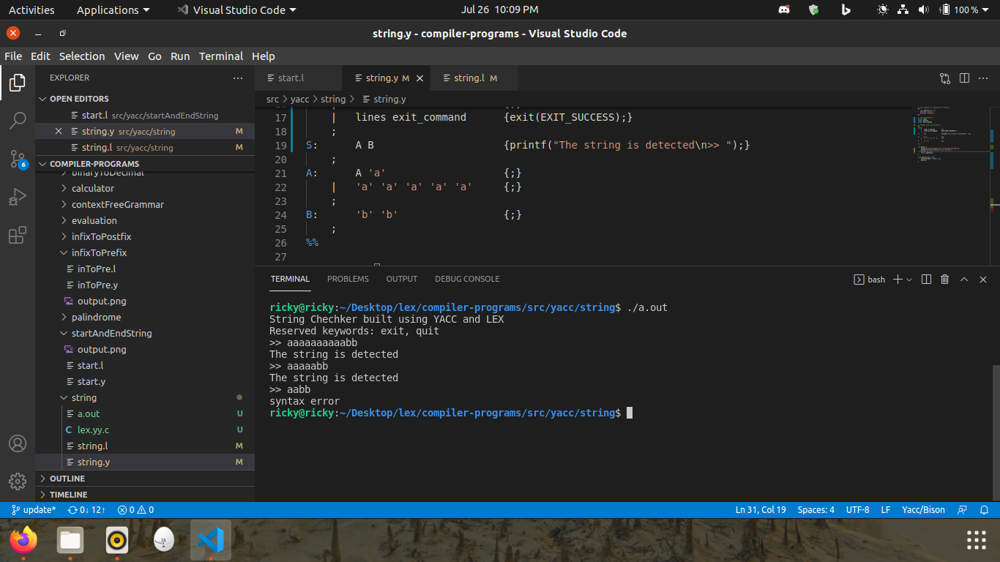
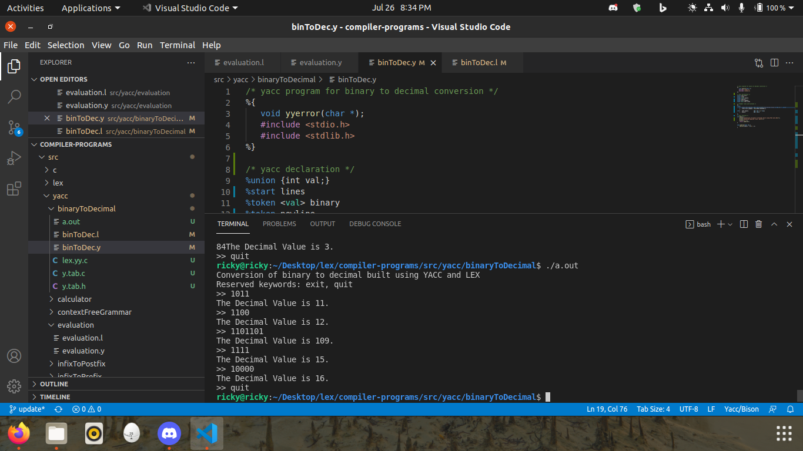
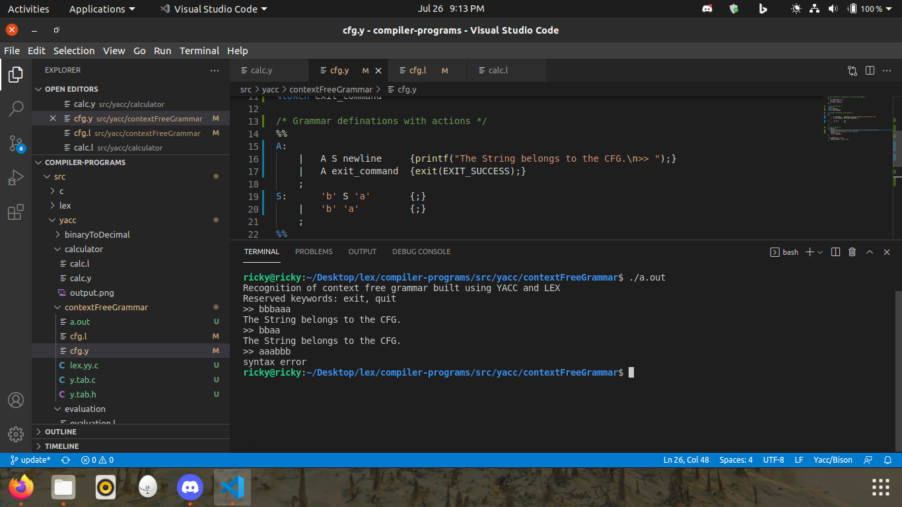
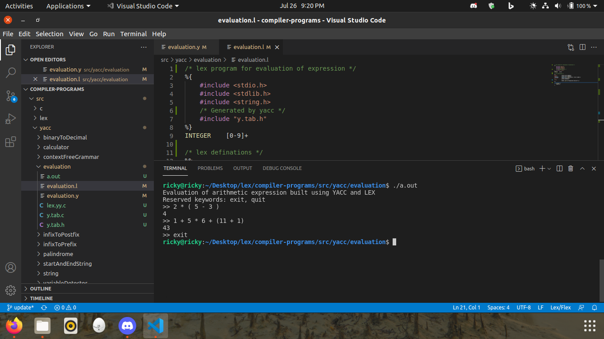
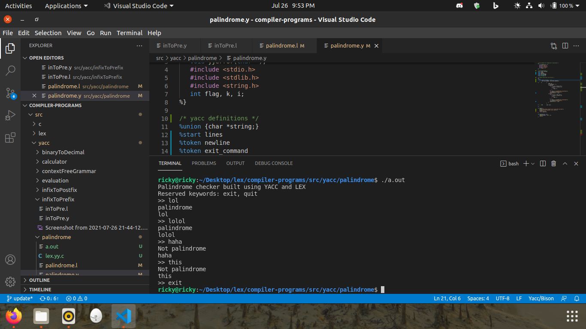
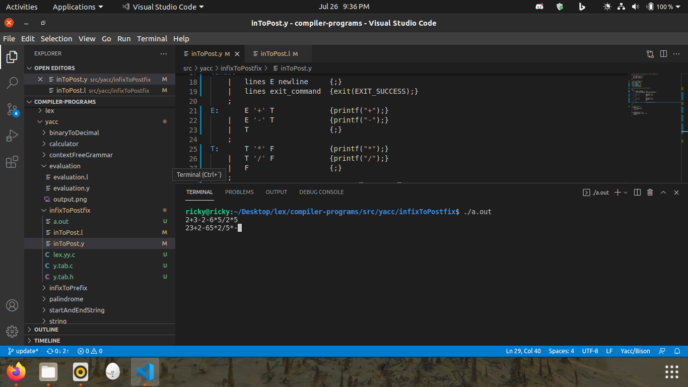
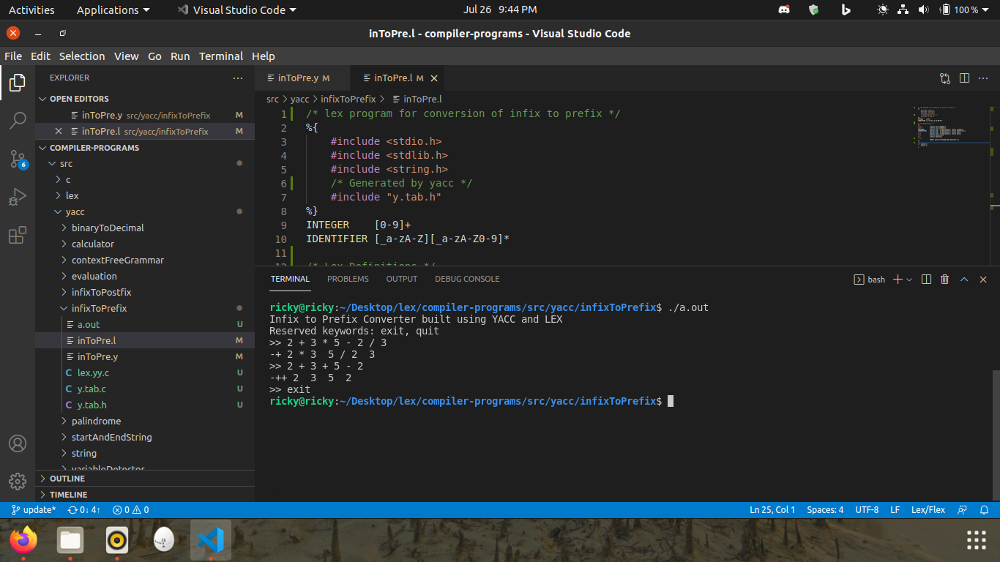
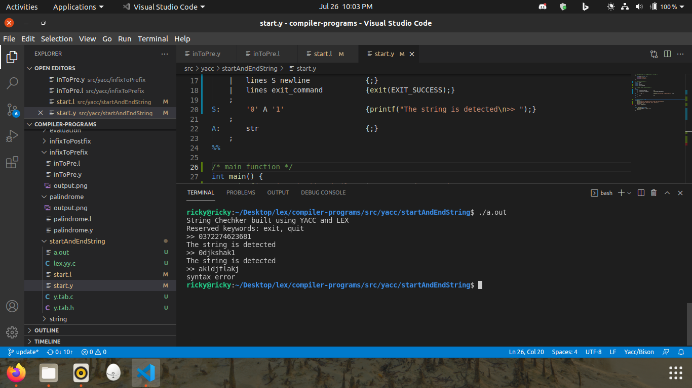
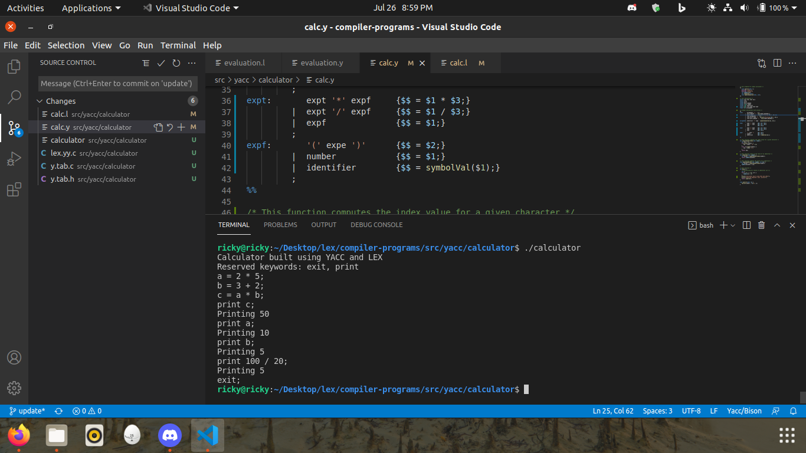
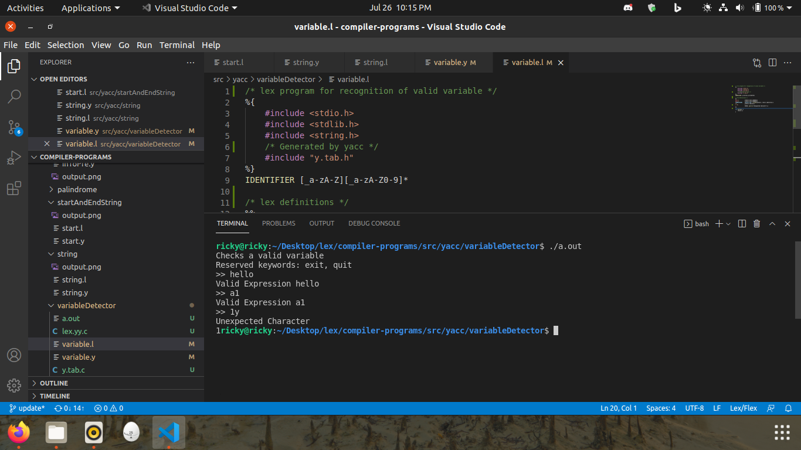

# Yacc Programs

## Strings
 [YACC program to recognize strings of { anbb | n≥5 }.](./code/yacc/string)

## Binary to Decimal
 [YACC program for Binary to Decimal Conversion.](./code/yacc/binaryToDecimal)

## Context free Grammar
 [YACC program to recognize string with grammar { bnan | n≥0 }.](./code/yacc/contextFreeGrammar)

    
## Evaluation
 [Yacc Program to evaluate a given arithmetic expression.](./code/yacc/evaluation)

    
## Palindrome
 [YACC program to check whether given string is Palindrome or not.](./code/yacc/palindrome)

    
## Infix to Postfix
 [YACC program for Conversion of Infix to Postfix expression.](./code/yacc/infixToPostfix)

    
## Infix to Prefix
 [YACC program for Conversion of Infix to Prefix expression.](./code/yacc/infixToPrefix)

## Start & End of a String
 [YACC program which accept strings that starts with 0 and ends with 1.](./code/yacc/startAndEndString)

## Calculator
 [YACC program to implement a Calculator and recognize a valid Arithmetic expression.](./code/yacc/calculator)

## Variable Detector
 [YACC program to recognize a valid variable, which starts with a letter, followed by any number of letters or digits.](./code/yacc/variableDetector)

